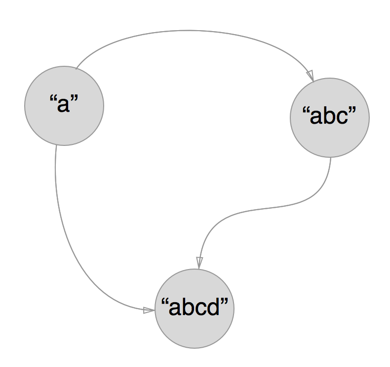
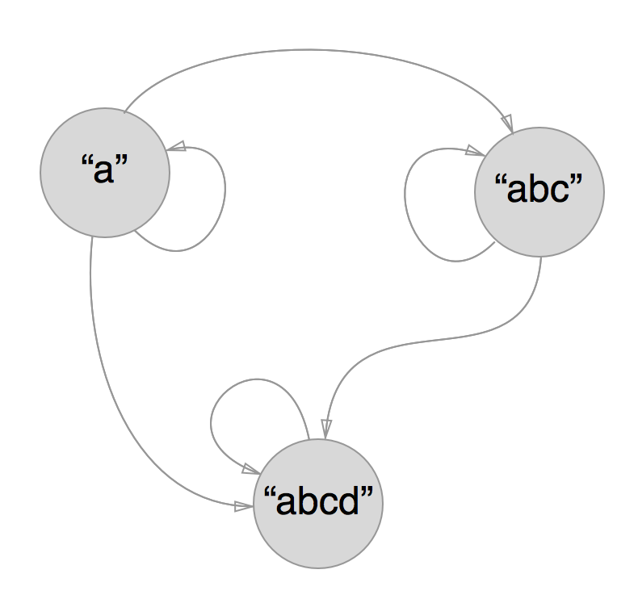
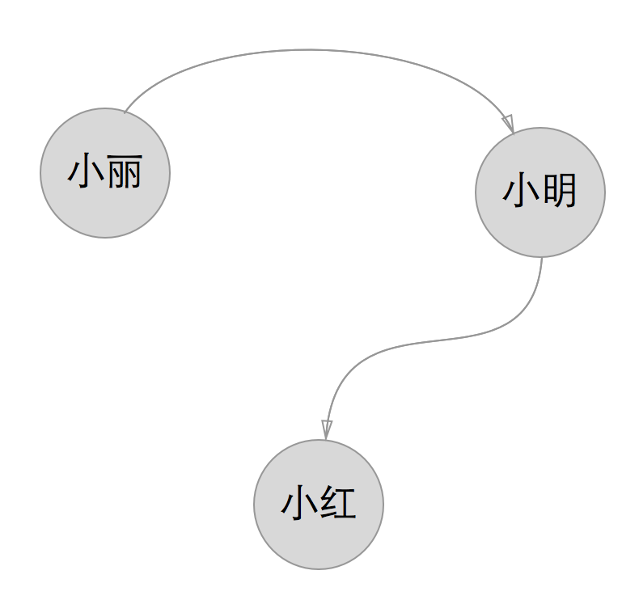
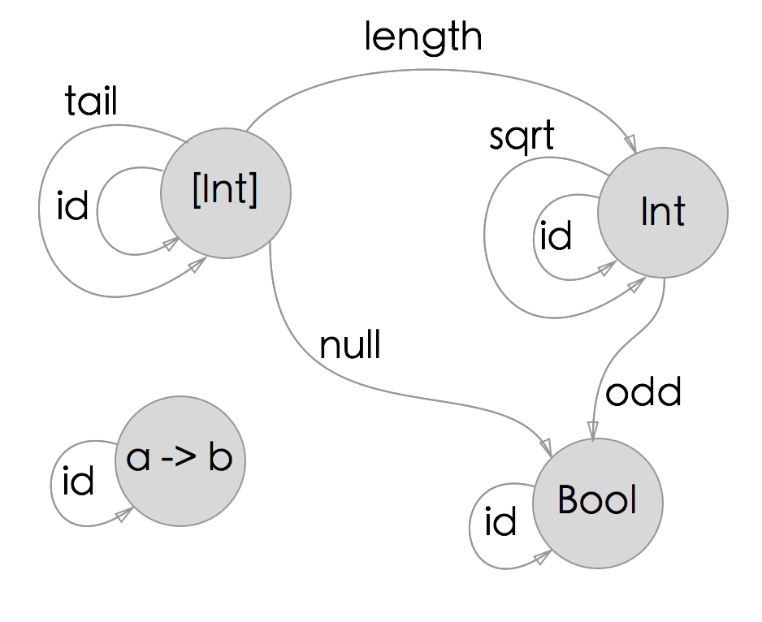
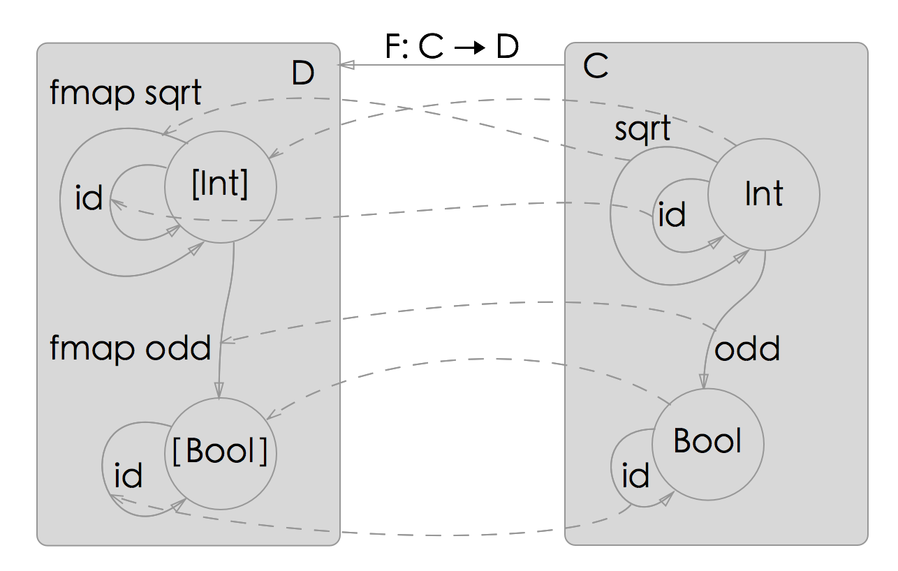

函子
====

函子是Haskell中最基本的类型类之一，正如所有的抽象始于对相似物体的概括，函子就是这样的抽象的一个概括，函子代表了一类相似的物体，例如列表表示的是一类有多个元素的物体，`Maybe`表示一类有可能不存在的物体等等。我们常常使用“容器”这个概念去理解函子，但这只是帮助我们理解的一个比喻，实际上函子的范畴远不止容器这么简单。让我们从它开始，进入Haskell的抽象世界。

函子 Functor
------------

回忆之前学习过的`Maybe`类型：

```
Maybe a = Just a | Nothing

Just 3 :: Maybe Int
Nothing :: Maybe a
```

我们说`Maybe a`代表一个装着`a`类型的值或什么都没装的盒子，当我们得到了一个`Maybe a`类型的时候，我们不能只处理盒子里有值的情况，还需要处理盒子是`Nothing`的情况：

```
addOneMaybe :: Maybe Int -> Maybe Int
addOneMaybe (Just a) = Just (a + 1)
addOneMaybe Nothing = Nothing

addOneMaybe (Just 3)
-- 4
addOneMaybe Nothing
-- Nothing
```

上面的例子中，我们希望可以处理一个包裹在`Maybe`里的`Int`数字，所以我们通过模式匹配提取了数字并加以处理，但是由于有可能拿不到数字，所以这个计算本身也是有可能失败的，于是我们把结果又重新包回了一个`Maybe`类型的盒子里，并且绑定了一个失败情况下的`addOneMaybe`，即如果遇到了参数是`Nothing`的情况，直接返回一个`Nothing`。

我们再看看一个列表的例子：

```
addOneList :: [Int] -> [Int]
addOneList = map (+1)

addOneList [1,2,3]
-- [2,3,4]
```

这次我们希望能够处理包裹在`[]`里的数字，我们的策略是把列表里的数字全部处理一遍，再重新放回列表中，而之前学习的`map`函数正好帮助我们完成了把每个元素都处理一遍的任务。

有没有发现上面两个例子的函数存在一个共同点：我们希望处理包裹在盒子的值，处理完成之后再放回盒子里，而如果盒子携带着某些额外信息（例如`Nothing`表示失败，列表表示多个元素），我们就保留这些额外的信息不变。通过这个过程抽象出的一个通用的类型就是：

```
someFunction :: f a -> f b
```

其中`f`是一个类型变量，例如刚刚的列表或者`Maybe`，而实际上，我们一般都有一个处理单独元素的函数：

```
someFunction :: a -> b
```

例如上例的`(+1)`，问题是我们能不能用一个统一的方法，从`a -> b`这个函数得到`f a -> f b`呢：

```
fmap :: (a -> b) -> f a -> f b
```

在Haskell中，我们把抽象出来的这个函数记作`fmap`，而被抽象出来的类型（列表，`Maybe`等）被叫做函子（Functor），对于列表来说，很容易看出`map`就是我们需要的`fmap`，但是对于`Maybe`呢？

```
fmap :: (a -> b) -> [a] -> [b]
fmap = map

fmap :: (a -> b) -> Maybe a -> Maybe b
fmap f (Just a) = Just (f a)
fmap _ Nothing = Nothing
```

看来也并不复杂，我们在接收到普通函数`f`和装在盒子里的`Just a`之后，用`f a`得到处理后的值，再用`Just`重新装到`Maybe`的盒子里。而如果遇到的是`Nothing`，则直接返回`Nothing`即可，因为`Nothing`可以代表任何类型的失败。

我们发现当盒子的类型不同时，`fmap`的实现也不同，而类型类正好是为了解决这个问题诞生的！让我们定义出函子这个类型类：

```
class Functor f where
    fmap :: (a -> b) -> f a -> f b
```

我们还需要提供列表和`Maybe`的类型类实例声明：

```
instance Functor [] where
    fmap = map

instance Functor Maybe where
    fmap f (Just a) = Just (f a)
    fmap _ Nothing = Nothing
```

然后我们就可以统一的使用`fmap`来处理列表和`Maybe`了！，由于函子类型类以及很多常见的类型的实例声明在Prelude中都已经提供了，我们可以去GHCi试试：

```bash
Prelude> fmap (+1) (Just 10)
Just 11
Prelude> fmap (+1) Nothing
Nothing
Prelude> fmap (+1) [1,2,3]
[2,3,4]
Prelude> fmap (+1) []
[]
Prelude> take 3 $ fmap (+1) (repeat 1)
[2,2,2]
```

其他是函子的类型例如双元组`(,) a`：

```
instance Functor ((,) a) where
    fmap f (x, y) = (x, f y)

fmap (+1) (2,3)
-- (2,4)
```

`(a,b)`是类型`(,) a b`的语法糖，我们把元组的第二个元素，也就是类型是`b`的元素当作盒子里等待处理的元素，而把`(,) a`当成一整个盒子，所以实例声明的时候是`instance Functor ((,) a)`，代表`(,) a`这一整个类型是函子。当我们把函数通过`fmap`作用到双元组的时候，我们其实只是把函数作用在第二个元素上面而已。

这里有个很有意思的函子需要费点脑筋，我们说函数类型中`a ->`这部分也是个函子，其中`b`是包裹在这个函子里的元素，而`a ->`这部分是构成函子的盒子，和元组类似，在Haskell中，`a -> b`是`(->) a b`的语法糖，所以我们说`(->) a`类型是一个函子，仔细想想如果我们想把某个`b -> c`的函数作用在盒子中`b`类型的元素上时，我们应该怎么处理？

```
instance Functor ((->) a) where
    fmap = ???
```

根据`(b -> c) -> f b -> f c`的类型，我们把`f`换成`(->) a`得到`(b -> c) -> (a -> b) -> (a -> c)`，这正好是之前说过的组合函数`(.)`的类型。我们可以这样来理解这个`fmap`的过程：`fmap`拿到了一个包裹在`(->) a`函子中的`b`类型的值，和处理`b`类型元素的`b -> c`类型的函数之后，通过组合函数把这个`b -> c`函数作用到盒子中`b`类型的结果上，得到`c`类型的结果，而得到的`a -> c`的函数，也可以看作是一个装在`(->)
a`类型的盒子里的`c`类型的值，正好符合`fmap`的类型要求，于是我们得到了`(->) a`的函子的定义：

```
fmap :: (b -> c) -> ((->) a b) -> ((->) a c)
-- 也就是
fmap :: (b -> c) -> (a -> b) -> (a -> c)

instance Functor ((->) a) where
    fmap f fa = f . fa
    -- 或者
    fmap = (.)

fmap (*2) (+1)
-- \x -> (x + 1) * 2
fmap (*2) (+1) $ 3
-- 8
```

这种把函数当作盒子来理解的方式，在后面的很多时候还会用到，其实在Haskell中函子这个类型类提供了一个很重要的抽象：容器类型，也就是说函子类型基本上都可以看作某种类型的容器，除了列表和`Maybe`之外，之后我们还会遇到`Vector`、`Array`、`Either`等等容器类型，我们通过`fmap`抽象出了一个通用的遍历容器内容进行处理的操作，进而可以通过`fmap`写出适用于任何容器类型的其他函数而不必关心具体类型是如何处理的，这是使用函子抽象的一个重要原因。

分类
----

Haskell的类型类提供了高于具体类型的抽象，为了更好的理解抽象类型，我们有必要抽象出一些概念以方便表达和理解，这是范畴学研究的一个主要目的，本章我们就来简单介绍下范畴论，然后使用范畴论的一些概念，来帮助我们更好地去理解函子。

在集合论中，集合（Set）代表了是一个含有某些共同性质的类型的集体，例如整数的集合，有理数的集合，字符串的集合等等，这些集合和Haskell程序中对应的概念就是具体的类型，例如`Int`、`String`等，但是相比集合本身的性质，我们有时更想了解集合和集合的关系，于是我们定义了映射，也就是Haskell中的函数，函数可以把一个集合里的元素映射到另一个集合中，而现在，我们想要了解这些映射还有没有更加有趣的性质。

于是我们定义了一个概念叫做分类（Category），在分类中，每个组成元素叫做物体（Object），它可能是个类型，也可能只是个值，或者是个其他的分类，我们不规定物体一定要像集合那样满足某些性质，但是我们要求在分类中，我们能够定义出物体和物体之间的关系，两个物体之间可能有关系，也可能没关系，我们把存在的关系叫做态射。态射不一定要是函数，例如对于一个含有"a"，"abc"，"abcd"的分类，我们可以规定`短于`是一个态射，那么"a"和"abc"之间存在这种态射，而"abcd"和"abc"之间不存在。我们现在试着用图表表示一下这个分类：



图表中的箭头代表短于这个态射，态射在图中是一个单向的箭头，从源物体（source）指向目标物体（target），实际上在分类学中，想要让上面的图表成为一个分类，还必须定义一个很重要的规则，就是如何组合两个态射，在上面的这个分类中，我们定义规则：如果x短于y，而且y短于z，则x短于z，这样我们就定义出了这个只有三个物体的分类。

我们试着用规范化的数学语言细化并明确分类的定义：

一个分类C，应该由如下3个要素组成：

+ 一个集合类ob(C)，其元素被称为`物体`；

+ 一个集合类hom(C)，其元素被称为`态射`。每个态射f都只有一个源物体a 及一个目标物体b（其中a 和b 都在ob(C) 內），态射f被称为从a至b的态射，记作f : a → b。

+ 一个二元运算，被称为态射组合，该组合使得对于任意三个物体a、b及c，都有hom(b, c) × hom(a, b) → hom(a, c)。两个态射f: a → b及g: b → c 的组合写作g ∘ f ，并符合下列兩个公理：

    + 结合律（Associativity）：若f: a → b、g: b → c及h: c → d，則h ∘ (g ∘ f) = (h ∘ g) ∘ f。

    + 单位律（Identity）：对于任意物体x，总存在一个态射idx: x → x（x 的单位态射），使得对于每个态射f: a → b，都会有idb ∘ f = f = f ∘ ida。

其中集合类（class）这个概念是指满足某一类特点的不含糊的集合，不含糊这个概念其实是为了避免罗素悖论，下面的定义就是一个非常含糊的集合：

    包含所有集合的集合。

这个集合应不应该包含自身呢？，如果它不包含了自身，显然它不符合定义，而如果它包含了自身，那么它发生了改变，产生的新的集合是不是也应该被包含呢？这么一直重复下去我们永远无法给出一个严格的定义，所以我们说这是一个含糊的集合。

就上面的集合类ob(C)和集合类hom(C)来说，我们暂时先理解成集合就好：对于一个分类，所有的物体构成了集合ob(C)，所有态射构成了集合hom(C)。

看来对于刚刚的分类，我们需要补充一个每个元素到自身的态射才能满足严格的数学定义，一种方式是，我们规定每个元素都短于它自身，这样每个元素就拥有了到自身的态射，这个上面的所有要求都符合。另一种方式是，我们再定义出一个更符合直觉的态射，叫做不长于，并规定出不长于和短于这两种态射是如何组合的，你可以验证下这个单位态射是否满足数学上idb ∘ f = f = f ∘ ida的要求，最后我们会得到下面这样的一张图表：



除了有不同物体之间的态射之外，我们还有每个物体自身到自身的态射，而且只要从a到b和从b到c有态射，从a到c也一定有态射，于是我们成功的定义出了一个分类。实际上，再范畴学中，我们把具有大小秩序的分类叫做有序类，其中只有一种秩序的（例如短于）叫做偏序类，而包含相反秩序的叫做全序类，这些分类之所以成为分类，也都是要满足某些关系的。

你可能会想，什么情况不算是分类，我们随意举个例子，对于一个三人小组，小明，小红和小丽，假设现在定义态射是暗恋关系，那么我们可能会有下面的图表：



这个图表之所以不是分类存在两个问题，一是暗恋关系没有对应的合成方法，小丽暗恋小明，小明暗恋小红，但这不足以说明小丽和小红的关系，她们可能甚至彼此不认识，二是每个物体没有到自身的映射。

当然上面的小组成为分类也很简单，你需要补充每个物体到自己的一个关系，例如每个人都讨厌自己，同时新增暗恋关系的组合规则，例如如果A暗恋B，B暗恋C，则A讨厌C。这个看似非常无聊的例子实际上在暗示分类的本质，**分类是对物体和物体之间对应关系的描述**，我们引入这个概念，是因为在程序中，数据和函数构成了各种各样的分类，这些分类很多时候都很模糊，而我们必须通过这些看似模糊的分类和他们满足的一些直觉上容易理解的性质，推导出一些直觉上不那么容易理解的性质。这是抽象的力量。

现在我们考虑在Haskell中的情况，Haskell中的所有类型可以构成一个巨大的分类Hask，Hask里的物体是一个个类型或者小的分类，不同物体之间的态射就是它们的函数，而态射组合的规则是通过组合函数`(.)`定义的。



而对于上面说的函子类型类，我们说函子可以把一个Hask中的分类C态射成了另外一个分类D，这个函子我们记作：F: C → D，例如对于列表函子和一个我们任选的分类C：



列表函子把分类C态射成了分类D，这里它做的事情有两件：

+ 把ob(C)映射成ob(D)，即把分类C中的每一个物体x映射成分类D中对应的物体F(x)，即一个物体的列表。

+ 把hom(C)映射成hom(D)，即把分类C中的每两个物体间的态射f映射成分类D中对应的态射F(f)，例如从sqrt映射到fmap sqrt。

我们注意到fmap id在D分类中出现在了id的位置，实际上我们遇到了函子在分类学上的第一个约束：

+ 单位律（identity）：F: C → D必须要把分类C中的id映射到分类D中的id。

紧接着，根据分类学的定义，如果物体A到物体B，物体B到物体C之间都有态射的话，物体A到物体C之间也一定存在态射，我们可以看出在分类C中从Int到Bool之间一定还存在一个态射odd ∘ sqrt，这个态射同样可以把Int变成Bool，而在分类D中也一定对应着一个映射fmap (odd ∘ sqrt)，实际上分类D中已经存在了fmap odd和fmap sqrt这两个被F: C → D映射过去的态射了，它们的组合(fmap odd) ∘ (fmap sqrt)出现在了被映射过去的fmap (odd ∘ sqrt)的位置上，我们现在遇到了函子在分类学上的第二个约束：

+ 组合律（composition）：F必须满足`F(f) ∘ F(g) ≡ F(f ∘ g)`，`≡`在这里代表同构（isomorphic），即在任何条件下都成立。

也就是说，在分类C中态射的组合等同于组合之后的态射在分类D中映射，换句话说，对于Haskell中的列表，`fmap (odd . (^2))`和`fmap odd . fmap (^2)`作用在列表上应该得到相同的结果：

```bash
Prelude> fmap (odd . (^2)) [1..10]
[True,False,True,False,True,False,True,False,True,False]
Prelude> (fmap odd . fmap (^2)) [1..10]
[True,False,True,False,True,False,True,False,True,False]
```

注意这里为了类型匹配并没有使用函数库中针对浮点数的`sqrt`，而是使用`(^2)`来求平方，第一个式子对列表中的每一个元素先求平方，再判断是否是奇数，第二个式子则是先对列表中的每一个元素求平方得到新的列表，再对这个新的列表中每一个元素做判断，所以第一个式子只需要遍历列表一次，而第二个式子需要先后遍历列表两次。

而分类学要求这两个式子的值必须相等，这也是Haskell编译器做融合循环优化的理论基础，多次遍历的组合等同于组合的遍历，我们用Haskell的语言再次描述一下函子必须满足的要求，函子实例的`fmap`必须满足下面的等式：

```
fmap id ≡ id
fmap (f . g) ≡ fmap f . fmap g 
```

可以把刚刚定义的列表和`Maybe`函子拿过来试试：

```bash
Prelude> fmap id [1..10] == id [1..10]
True
Prelude> fmap id Nothing == id Nothing
Prelude> fmap (odd . (^2)) (Just 3) == (fmap odd . fmap (^2)) (Just 3)
True
Prelude> fmap (odd . (^2)) Nothing == (fmap odd . fmap (^2)) Nothing
True
```

这是我们把分类学里的约束引入Haskell得出的约束，注意，当你声明一个函子的实例的时候，编译器并不能帮助你检查你的`fmap`是否满足这两个约束，因为函数是无法比较相等的，你需要通过自己的推理自行验证这两个约束是成立的，而实际上对于一个函子类型，满足上面两个约束条件的`fmap`是唯一确定的，这也是为什么GHC可以帮助你推导函子实例的原因，请仔细思考一下，对于列表来说，有可能写出一个满足上面两个条件，且和`map`不等价的`fmap`吗？

Identity Const
--------------

在函子的世界中有两个非常有趣的函子：`Identity`和`Const`，它们代表了容器概念的两个极端。我们先来看`Identity`，`Identity`函子代表最简单的容器，相当于把`Maybe`中的`Nothing`去掉，只有一个构造函数用来把值装到盒子里，考虑到`newtype`语法可以避免底层的打包解包，我们这么定义`Identity`：

```
newtype Identity a = Identity { runIdentity :: a }

Identity 3 :: Identity Int

runIdentity $ Identity 3
-- 3
```

我们使用记录语法定义了一个只有一个参数的构造函数`Identity`用来把值装进盒子里，然后提供了`runIdentity`函数方便我们把值从盒子中取出，现在我们需要提供`Identity`的函子类型类的实例声明：

```
instance Functor Identity where
    fmap f idx = Identity (f (runIdentity idx))
    -- point-free写法
    fmap f = Identity . f . runIdentity

fmap (+1) (Identity 3)
-- Identity 4
```

这个函子的`fmap`也相当于没做什么，只是简单的把值从盒子中取出，应用下`f`，然后装回到盒子中。这个过程和函数`id`很像。`Identity`代表着不含任何额外上下文信息的盒子，试着用上面说到的函子需要满足的两个条件看看`Identity`是否满足：

```
fmap id (Identity 3) == id (Identity 3)
fmap ((+1) . (*2)) (Identity 3) == (fmap (+1) . fmap (*2)) (Identity 3)
```

很容易看出这两个条件是满足的。我们再来看看另外一个更加奇特的函子`Const`：

```
newtype Const a b = Const { getConst :: a }

Const 3 :: Const Int String
Const 3 :: Const Int Int
...

getConst (Const 3)
-- 3
```

`Const`看起来和`Identity`很像，构造函数也只有一个参数，所以我们同样使用的`newtype`的把戏来优化代码的速度，至于为什么这里用`get...`来提取，而上面用`run...`，只能说是个不幸的命名事故，有趣的地方在于`Const 3`构造出来的值的类型是`Const Int a`，这个额外的类型变量在之前提到过，允许`Const 3`成为各种类型：`Const Int Int`、`Const Int String`...如果`newtype`或者`data`声明时，`=`左边出现的类型变量没有出现在右边，我们就把这样定义出来的类型叫做幻影类型（Phantom
type），例如上面的`Const`就是一个幻影类型，幻影类型有趣的地方在于，对于一个幻影类型的值来说，例如`Const 3`，它的具体类型是不确定的，但是通过幻影类型本身携带的额外的类型变量，我们却可以让编译器区分相同的两个值：

```
Prelude> import Control.Applicative
Prelude Control.Applicative> Const 3 == Const 3
True
Prelude Control.Applicative> (Const 3 :: Const Int Int) == (Const 3 :: Const Int String)

<interactive>:5:32:
    Couldn't match type ‘[Char]’ with ‘Int’
    Expected type: Const Int Int
      Actual type: Const Int String
    In the second argument of ‘(==)’, namely
      ‘(Const 3 :: Const Int String)’
    In the expression:
      (Const 3 :: Const Int Int) == (Const 3 :: Const Int String)
    In an equation for ‘it’:
        it = (Const 3 :: Const Int Int) == (Const 3 :: Const Int String)
```

我们先导入定义了`Const`的模块Control.Applicative，然后我们试着比较一下`Const 3`，当我们不提供类型说明的时候，编译器推断它们的类型一定是相同的不然无法比较，但是当我们试着提供不同的类型注释的时候，我们发现在编译器看来，`Const 3 :: Const Int Int`和`Const 3 :: Const Int String`由于类型不同是无法比较的。

这也是为什么用`type`无法定义幻影类型，因为`type`定义的类型仅仅是类型别名罢了，假如我们有下面的别名：

```
type Foo a = Int
(3 :: Foo String) == (3 :: Foo Char)
-- (3 :: Int) == (3 :: Int)
-- True
```

在类型检查的第一步，这些类型别名就会被替换成真正的类型，所以在编译器看来`Foo String`和`Foo Char`都是同一个类型，它们不过是`Int`的别名罢了。

搞懂了幻影类型之后，你一定要问了，为什么我们需要这么奇怪的一个类型`Const a b`？这个问题在下个章节很快就会得到解释，我们需要关注的是`Const a b`类型中，我们认为`b`类型的值是盒子里的装载，而`a`类型的值是盒子的一部分，而构造函数并不需要提供`b`类型的参数，因为我们根本就不关心盒子里装的是什么，构造`Const a
b`时我们也根本没有往里面装任何东西，我们关心的是写在盒子上面的`a`的值，我们来看`Const a`的函子类型类实例声明：

```
instance Functor (Const a) where
    fmap f c = c
```

这里的`fmap`的类型是`fmap :: (b -> c) -> Const a b -> Const a c`，我们把`Const a`当成一整个盒子。因为我们不关心盒子里装着什么，所以我们直接把接到`b -> c`类型的函数`f`丢弃，返回接收到的`c`。这里我们实际上把`c`的类型从`Const a b`转换到了`Const a c`，而对于`c`来说，这个值的类型可以是任意的`Const a x`，而我们不需要对`c`做任何处理。

`Const a`代表了盒子抽象的另一个极端，这是一个什么都没有装的空盒子，通过幻影类型，`Const a b`给你产生了盒子里装有一个`b`类型的值的幻觉，但实际上这个值根本不存在，而对这个盒子做`fmap`的结果相当于什么都不做，原封不动的把盒子返回即可，有兴趣的读者可以验证下，函子的两个约束它是否满足呢？

IO函子
-----

对于Haskell来说，我们通过`IO`类型来建模外部世界，当然彻底的理解这个类型还需要你阅读接下来的好几个章节，不过在这里，我们可以简单地提一下，`IO`类型是一个函子，而我们可以用`fmap`来操作包裹在`IO`中的值：

```
module Test where

main :: IO ()
main = do
    l <- fmap length getLine
    print l
```

把上面的程序写到一个`Test.hs`文件中，然后使用`runHaskell Test.hs`运行它：

```bash
$ runHaskell Test.hs
dwqdad
6
```

程序会计算你输入的字符串的长度，然后打印出来，先不要管`do`、`<-`这些语法，后面会详细的讲解，对于`fmap length getLine`这段代码你可以会觉得有些奇怪，`length`不应该作用在字符串上吗？实际上`getLine`的类型是包裹在`IO`中的：

```
getLine :: IO String
```

这意味这`getLine`的值需要和外界交互（这里指的是等待用户输入了），而由于`IO`类型是个函子，所以如果你希望能够把`length`作用在`IO String`类型的值上，你就需要使用`fmap`把你的函数从`String -> Int`类型的`length`，变成`IO String -> IO Int`类型的`fmap length`。

从一个更大的视角来看，`fmap`可以把一个`a -> b`类型的函数变成`f a -> f b`类型的函数，从而作用在任意类型的被包裹在函子中的值上，我们把这个过程叫做升格（lift），即让函数的作用范围从一个分类进入另一个分类，在Haskell中，不同的类型类有着不同的升格操作，而对于函子类型类来说，升格操作就是`fmap`。

从这一章起，接下来的若干章节将继续关注很多抽象出来的类型类和对应方法的语义，就像学习物理中的动量守恒定律一样，你需要理解`Σ m * v = Σ m' *
v'`，但你不用忙着记忆它，你要记住的是它的物理意义。在Haskell中类型类的方法实现随着实例类型不同而不同，但是我们并不需要把太多的关注放在这些方法的具体实现上，我们需要理解的是抽象出来之后的方法，在所有实例上表达的一个共同的计算规则，这就是类型类的方法包含的语义。
